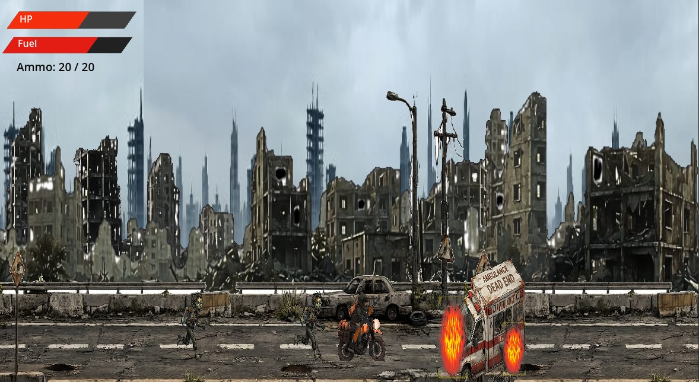

  

<h1 align="center"> Zombie-Motor </h1>

  <strong>It is a 2D game about a man who rides a motorbike across the end of the world, trying to escape from zombies and deliver the antidote to hospitals to treat zombies.</strong>

---
## (Controls)

| (Key) | (Action) |
| :--- | :--- |
| W / space |(jump) |
| E / left click | (shoot) |
| A / Left Arrow | (move left) |
| D / Right Arrow | (move right) |
| R | (reload gun) |
| Enter | (reload game when won) |

---
## The used programs to make the Game:
* **Godot Engine 4**: To make the game
* **Audacity**: To edit the soundeffects
* **programming language**: Godot script

---
## Game link:
*https://moksha2009.itch.io/zombie-motor*
